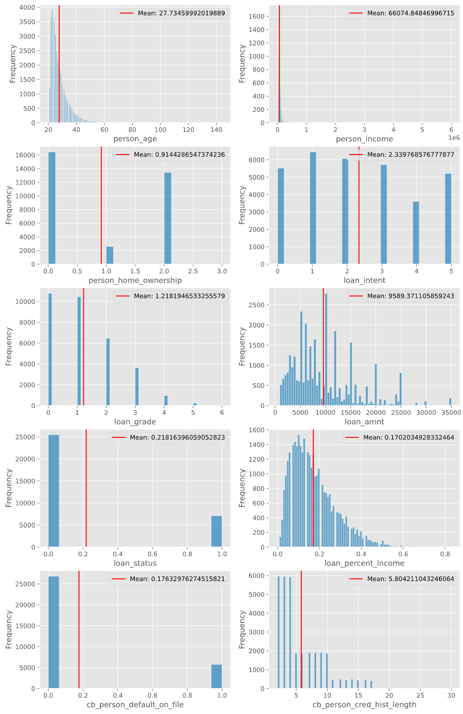
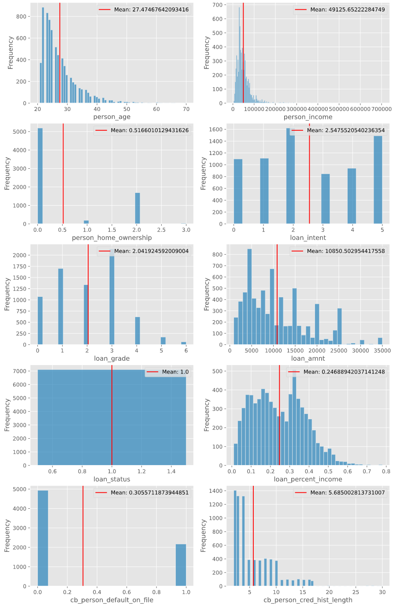
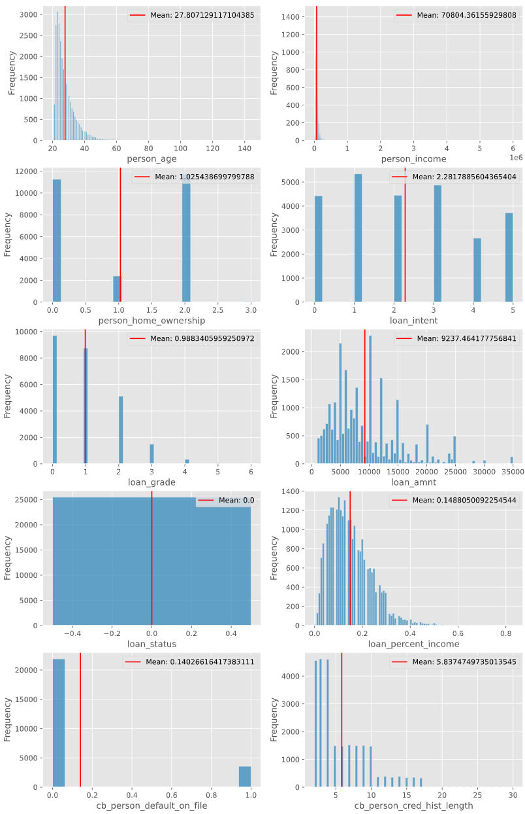
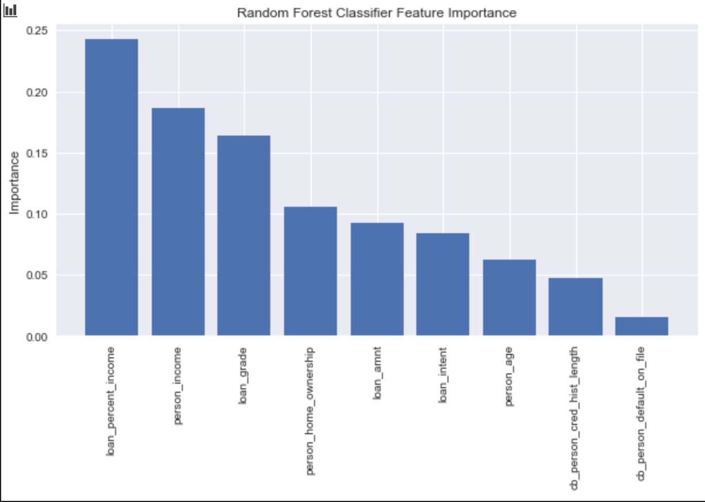

# Bank Credit Default Prediction
This project seeks to create a model to predict bank loan defaults using the random forest classifier algorithm. 

# Data Description
The data consists of 32,581 rows of data that contains the following features:
|Feature Name | Description |
| ----------- | ----------- |
|person_age|	Age|
|person_income|	Annual Income|
|personhomeownership|	Home ownership|
|personemplength|	Employment length (in years)|
|loan_intent|	Loan intent|
|loan_grade|	Loan grade|
|loan_amnt|	Loan amount|
|loanintrate|	Interest rate|
|loan_status|	Loan status (0 is non default 1 is default)|
|loanpercentincome|	Percent income|
|cbpersondefaultonfile|	Historical default|
|cbpresoncredhistlength|	Credit history length|

Data from: https://www.kaggle.com/laotse/credit-risk-dataset

# Data Cleaning
The following was done to make the data useful for this project:  
- loan_intent, person_home_ownership, loan_grade, and cb_person_default_on_file were changed to numberical categories.
- loan_int_rate and person_emp_length were removed due to missing data.

# Data Exploration

Initial analysis tried to differentiate default customers and non-default customers. Initial findings suggested that customers that customers that default on loans tend to have low loan rating and the loan to income ratio is typically higher.

The following visualizations show customers that do not default on loans.

  
Feature analysis was ran using random forest classifer, and findings suggested that loan to income percentage was the feature with the highest importance followed by person's income and loan grade.

# Modelling and Predictions
The dataset was modelled succesfully with the random forest algorithm. The following metrics were achieved.

||precision |recall |f1-score |support|
|----------|----------|-------|---------|-------|
|non-default |0.92 |0.98 |0.95 |5072
|default |0.92 |0.71 |0.80 |1445
|accuracy| ||0.92| 6517|
|macro avg| 0.92| 0.85| 0.88| 6517|
|weighted avg| 0.92| 0.92| 0.92| 6517|